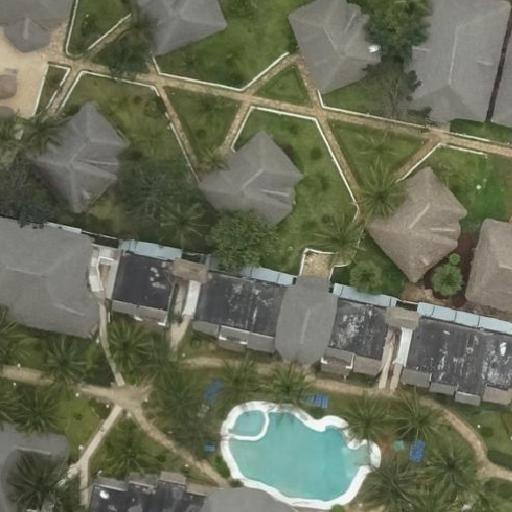

# FINAL YEAR PROJECT

## About the project

- First segmentation and classification is trained separately.
- Then trained models are stored in pickle file.
- Both segmentation and classification model are used in the flask to build the flask api.
- The main job segmentation model to find all the building inside a image.
- Then the classisication model will classify building(complete,incomplete,foundation or empty).
- The api will produce output for image of size 512x512.
## Final output

### Input image
 

### Output image

## Author of code

- SIDHARTH BISAL

## Contributors

- Ishan Ayus
- Bishnu Prasad Sahoo

